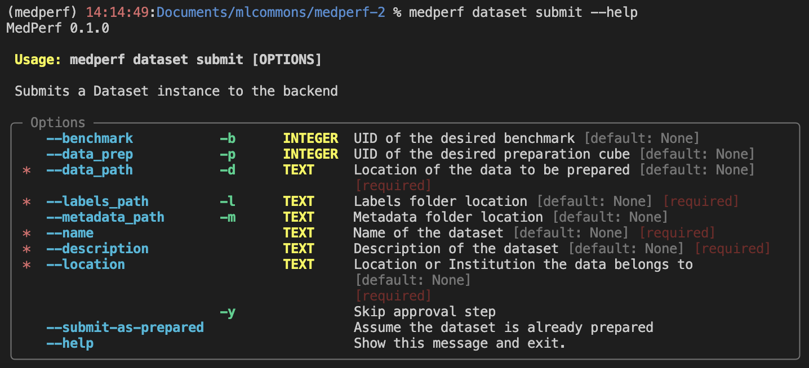
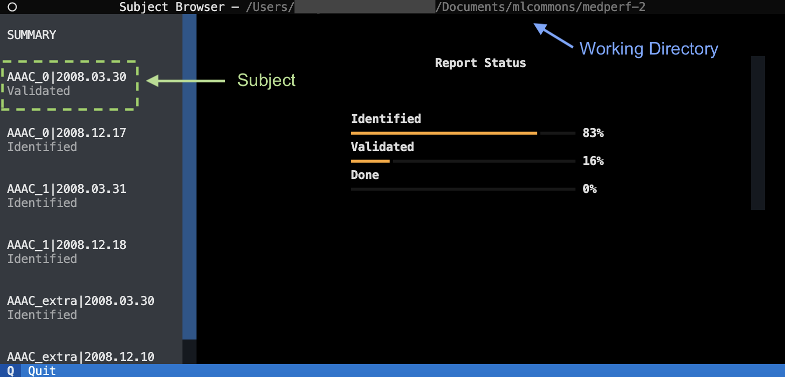
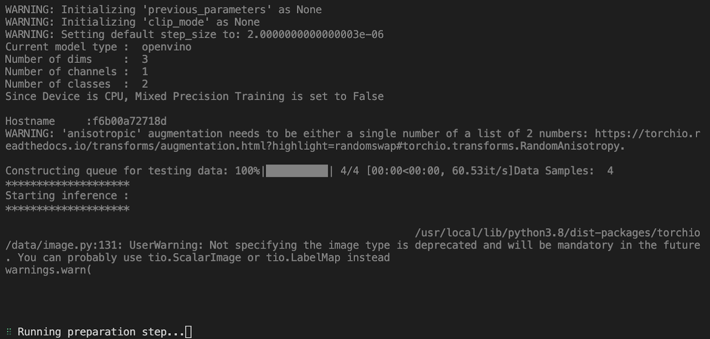
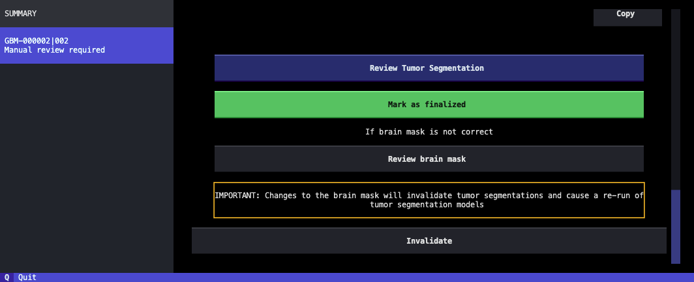
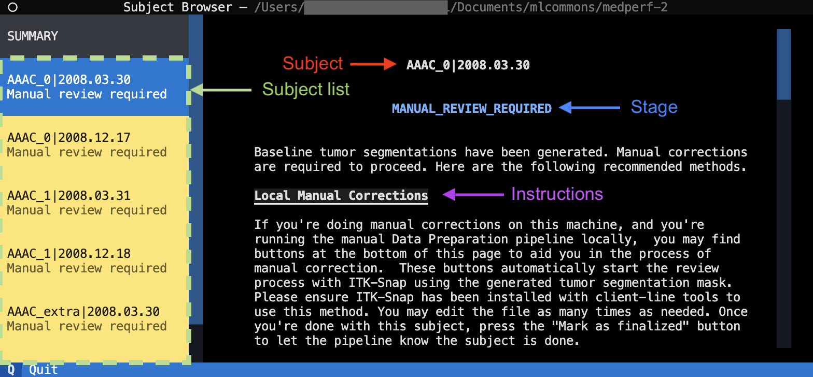
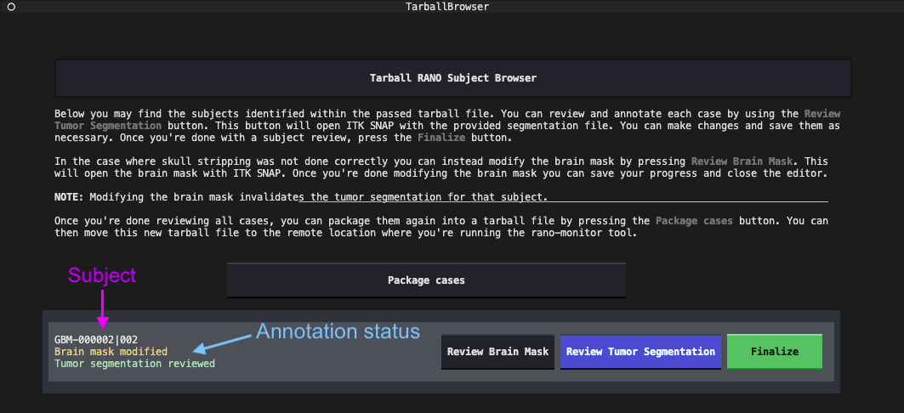
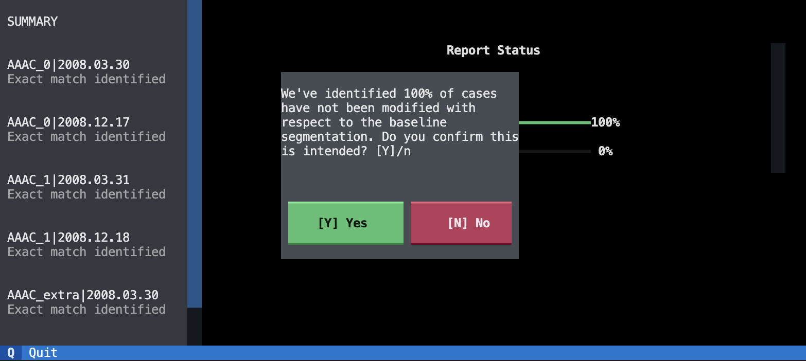
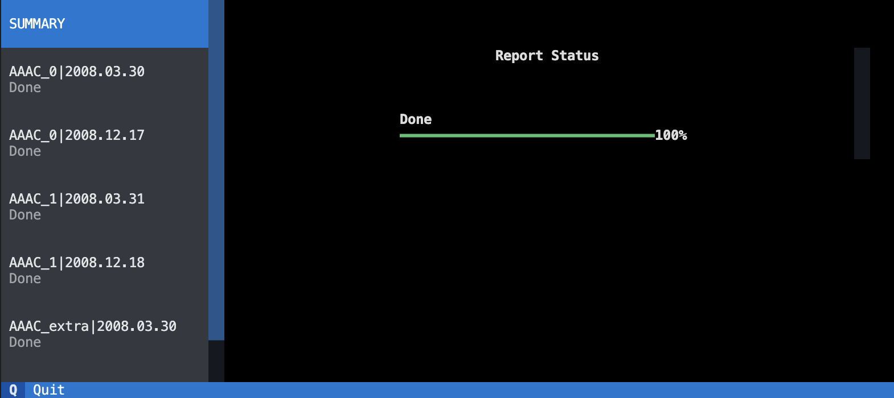

# RANO Federation

## Table of contents
- [RANO Federation](#rano-federation)
  - [Table of contents](#table-of-contents)
  - [Introduction](#introduction)
  - [System Requirements](#system-requirements)
- [Instructions](#instructions)
  - [Install a containerization tool](#install-a-containerization-tool)
    - [Installing Docker](#installing-docker)
    - [Installing Singularity](#installing-singularity)
  - [Install ITK-SNAP](#install-itk-snap)
  - [Structuring your data](#structuring-your-data)
    - [DICOM Data (STRONGLY PREFERRED)](#dicom-data-strongly-preferred)
    - [Non-Preprocessed NIfTI Data](#non-preprocessed-nifti-data)
    - [Co-Registered and Skull-Stripped NIfTI Data](#co-registered-and-skull-stripped-nifti-data)
    - [Co-Registered and Skull-Stripped NiFTI with accompanying tumor segmentation](#co-registered-and-skull-stripped-nifti-with-accompanying-tumor-segmentation)
  - [Setting up MedPerf](#setting-up-medperf)
    - [Set up your MedPerf profile](#set-up-your-medperf-profile)
      - [Setting Singularity as the default container runner](#setting-singularity-as-the-default-container-runner)
      - [Setting the number of GPUs](#setting-the-number-of-gpus)
  - [Executing the Data Preparation Procedure](#executing-the-data-preparation-procedure)
    - [Preparation with MedPerf](#preparation-with-medperf)
    - [Monitoring tool](#monitoring-tool)
- [Additional Information](#additional-information)
  - [Updating MedPerf](#updating-medperf)

## Introduction

MedPerf is an open benchmarking platform for medical artificial intelligence using Federated Evaluation. This document will provide all the details required for installing the MedPerf package for the Data preparation stage of the FL – POST challenge. This document enlists the system requirements for the project, available documentation, and instructions for running the MedPerf for the Data preparation task.

## System Requirements

1. Operating System: Supported operating systems include Ubuntu Linux 18+ and Windows 10+ with Windows Subsystem for Linux. Other operating systems may work but are not officially supported.
2. Memory Requirements: 16GB or more
3. Storage: 25GB for MedPerf and accompanying MLCube. Also at least 2 times the size of your dataset must be available to proceed (e.g. your dataset weights 100GB, then you should have an additional 200GB available)

    **Note:** If using Singularity, we need an additional 100GB of space for the Docker image conversion.

1. Graphics Card (GPU): A GPU with 12GB or more VRAM.

    [Back To Top &uarr;](#table-of-contents)

# Instructions

## Install a containerization tool

MedPerf uses container technology to enable running code on the host machine. Because of this, a containerization tool needs to be installed on your machine prior to going through the preparation procedure. We currently support Docker and Singularity. Only one of the two options is required:

### Installing Docker

1. To install Docker on Ubuntu-based machines, please follow the instructions outlined [here](https://docs.docker.com/engine/install/ubuntu/). For Windows with WSL, please refer to [this guide](https://learn.microsoft.com/en-us/windows/wsl/tutorials/wsl-containers).
2. Confirm that you can run docker **without** sudo. If the following command runs without error, you can skip this section:
```
docker run hello-world
```

3. If the above fails, first ensure that you have installed docker _including the recommended post install steps_: [https://docs.docker.com/engine/install/](https://docs.docker.com/engine/install/).
4. If you are still not able to run the hello-world command without sudo on Linux, there are several potential fixes. First, make sure you have followed the post install instructions from the link in step 2. Next, you can try to run the following commands, rechecking the hello-world command after each one:
```
sudo systemctl restart docker
unset DOCKER_HOST
docker context use default
```

5. Note that docker rootless is not supported and may result in issues. It is recommended to remove docker rootless before proceeding.

### Installing Singularity

1. To install singularity, please refer to the following [instructions](https://docs.sylabs.io/guides/3.0/user-guide/installation.html). For Windows with WSL, follow [this article](https://www.blopig.com/blog/2021/09/using-singularity-on-windows-with-wsl2/).
2. Confirm your installation is working correctly by running the following commands
```
singularity pull docker://godlovedc/lolcow
singularity run lolcow_latest.sif
```

    [Back To Top &uarr;](#table-of-contents)

## Install ITK-SNAP

ITK-SNAP is the preferred tool for making annotations on the data. It is supported by default by the provided tools, and automations have been provided to simplify the annotation process. For both Linux and windows with WSL, please follow the instructions for [installing ITK-SNAP on Linux](http://www.itksnap.org/pmwiki/pmwiki.php?n=Documentation.TutorialSectionInstallation).

If using a Windows WSL, you may need to install the following dependencies to get ITK-SNAP working:
```
sudo apt-get update -y
sudo apt-get install -y libglvnd-dev
sudo apt-get install -y libxkbcommon-x11-0
sudo apt-get install -y qtwayland5
```

You can verify your installation by running the following command on a new terminal window
```
itksnap
```

If ITK-SNAP starts after running the command, your installation is successful.

[Back To Top &uarr;](#table-of-contents)

## Structuring your data

In order to start the data preparation procedure, it is necessary to ensure that the input data is structured in a way that MedPerf can identify and process correctly. You may create your data directory anywhere, but please ensure that it is in a location with relatively fast read/write access and with at least 2x more free disk space than your dataset currently occupies.

**Note:** Input can be either <ins>DICOM files (before any coregistration or skull-stripping), non-preprocessed NIfTI files (before any coregistration or skull-stripping), or fully preprocessed, coregistered, skullstripped NIfTI files.</ins>

Several different data structures are currently supported. Please ensure your data follows one of these possible folder structures before continuing:

### DICOM Data (STRONGLY PREFERRED)

The data preparation process can handle DICOM images that have not been co-registered nor skull-stripped.For this, your data needs to follow a folder hierarchy where images are separated by `<PatientID>/<Timepoint>/<Series>`

**Please note:** Series-level folders must use the following abbreviations: t2f (T2-weighted FLAIR), t1n (T1-weighted non-contrast), t1c (T1-weighted with contrast), and t2w (T2-weighted). For more information about the required series, please [refer to the FeTS 2.0 manual](https://docs.google.com/document/d/1DVyGJBOBR-B_7uDRMp9Cnkj6pIXosgzCZa-qQS-olTc/edit#heading=h.ctr3ehc5ev9c). PatientID and Timepoint must be unique between and within patients, respectively, and Timepoint should be sortable into chronologic order.
```
.
├──AAAC_0
│  ├──2008.03.30
│  │  ├──t2f
│  │  │  ├──t2_Flair_axial-2_echo1_S0002_I000001.dcm
│  │  │  └──...
│  │  ├──t1n
│  │  │  ├──t1_axial-3_echo1_S0003_I000001.dcm
│  │  │  └──...
│  │  ├──t1c
│  │  │  ├──t1_axial_stealth-post-14_echo1_S0014_I000001.dcm
│  │  │  └──...
│  │  └──t2w
│  │  │  ├──T2_SAG_SPACE-4_echo1_S0004_I000001.dcm
│  │  │  └──...
```
### Non-Preprocessed NIfTI Data

Although DICOM data is strongly preferred, the Data preparation pipeline supports NIfTI files that are not yet co-registered nor skull-stripped. For the data preparation procedure to handle this scenario, a strict folder structure and naming convention must be followed. Please ensure your NIfTI files are contained in a `<PatientID>/<Timepoint>` folder structure, and that each NIfTI image is named as `<SeriesAbbreviation>.nii.gz`. Please note, this workaround should only be used if you no longer have access to the original DICOM data!
```
.
├──AAAC_0
│  ├──2008.03.30
│  │  ├──t1c.nii.gz
│  │  ├──t1n.nii.gz
│  │  ├──t2f.nii.gz
│  │  └──t2w.nii.gz
│  ├──2008.12.17
│  │  ├──t1c.nii.gz
│  │  ├──t1n.nii.gz
│  │  ├──t2f.nii.gz
│  │  └──t2w.nii.gz
```

### Co-Registered and Skull-Stripped NIfTI Data

Additional to non-preprocessed NIfTI files, the Data preparation process supports NIfTI images that have already been previously prepared such that the data are co-registered to each other, in the SRI atlas space, and the skull of the patient is removed such that only the brain is present. For these cases to be identified, a strict naming convention must be followed, where each NiFTI file is named as `<PatientID>_<Timepoint>_brain_<SeriesAbbreviation>.nii.gz`. Please note, this workaround should only be used if you no longer have access to the original DICOM data!
```
.
├──AAAC_0
│  ├──2008.03.30
│  │  ├──AAAC_0_2008.03.30_brain_t1c.nii.gz
│  │  ├──AAAC_0_2008.03.30_brain_t1n.nii.gz
│  │  ├──AAAC_0_2008.03.30_brain_t2f.nii.gz
│  │  └──AAAC_0_2008.03.30_brain_t2w.nii.gz
│  ├──2008.12.17
│  │  ├──AAAC_0_2008.12.17_brain_t1c.nii.gz
│  │  ├──AAAC_0_2008.12.17_brain_t1n.nii.gz
│  │  ├──AAAC_0_2008.12.17_brain_t2f.nii.gz
│  │  └──AAAC_0_2008.12.17_brain_t2w.nii.gz
```
A folder hierarchy of `PatientID/Timepoint` is preferred, but the pipeline also correctly handles structures where all timepoints are combined for a given patient.
```
.
├──AAAC_0
│  ├──2008.03.30
│  │  ├──AAAC_0_2008.03.30_brain_t1c.nii.gz
│  │  ├──AAAC_0_2008.03.30_brain_t1n.nii.gz
│  │  ├──AAAC_0_2008.03.30_brain_t2f.nii.gz
│  │  └──AAAC_0_2008.03.30_brain_t2w.nii.gz
│  │  ├──AAAC_0_2008.12.17_brain_t1c.nii.gz
│  │  ├──AAAC_0_2008.12.17_brain_t1n.nii.gz
│  │  ├──AAAC_0_2008.12.17_brain_t2f.nii.gz
│  │  └──AAAC_0_2008.12.17_brain_t2w.nii.gz
```

### Co-Registered and Skull-Stripped NiFTI with accompanying tumor segmentation

Lastly, the pipeline can also handle cases where brain-isolated NiFTI images are provided, along with a tumor segmentation mask. Additional to all requirements specified for Skull-stripped NiFTIs, the tumor segmentation must follow a strict naming convention as well, of `<PatientID>_<Timepoint>_final_seg.nii.gz`.

**Note:** The data preparation pipeline will assume the tumor segmentation to have already been manually corrected, but you will have the opportunity to make further modifications if needed as explained in the **manual annotations** section.
```
.
├──AAAC_0
│  ├──2008.03.30
│  │  ├──AAAC_0_2008.03.30_brain_t1c.nii.gz
│  │  ├──AAAC_0_2008.03.30_brain_t1n.nii.gz
│  │  ├──AAAC_0_2008.03.30_brain_t2f.nii.gz
│  │  ├──AAAC_0_2008.03.30_brain_t2w.nii.gz
│  │  └──AAAC_0_2008.03.30_final_seg.nii.gz # Segmentation mask
```

[Back To Top &uarr;](#table-of-contents)

## Setting up MedPerf

1. Download or Clone the MedPerf branch for this MLCube

    This command will download / clone the MedPerf package to the local machine and this will be used to build the MLCube. It is recommended to run this command in your user/home directory.
    ```
    git clone --branch data-prep-manual-steps https://github.com/aristizabal95/medperf-2 ./medperf
    cd medperf
    ```
    <figure>
      
      <figcaption>Figure 1. MedPerf GitHub repository. This repository can be downloaded or cloned to the work machine.</figcaption>
    </figure>
    
2. Installing MedPerf Package

    MedPerf is best installed using a virtual environment. We recommend using Anaconda. Anaconda installation instructions can be found here: [https://docs.anaconda.com/free/anaconda/install/index.html](https://docs.anaconda.com/free/anaconda/install/index.html). If you prefer not to install Anaconda (not recommended), then ensure that you have python 3.9x with pip and skip to step 3.

      - Using Anaconda, create a virtual environment named MedPerf-env with the following command:
    ```
    conda create -n MedPerf-env python=3.9
    ```

      - Now we will activate the created environment so that we can use it. From the above step, we have created an environment named 'MedPerf-env'. The following command will activate the environment:
    ```
    conda activate MedPerf-env
    ```

3. Install the latest version of MedPerf from source. This can be done by running the below command inside the MedPerf folder.
```
pip install -e ./cli
```

1. Verify the Installation, Check the version of the MedPerf package that was installed. The expected output is: MedPerf version x.x.x
```
MedPerf --version
```

1. Create a MedPerf account if you do not already have one. Keep in mind that the MedPerf team must give you clearance before you can create your user account. If you're having trouble signing up, please contact the MedPerf team.

    Navigate to [https://www.MedPerf.org/](https://www.MedPerf.org/) and click the "Sign Up" link in the top right. Enter your email, and verify using the code sent to your email address.

2. Log into the MedPerf CLI with your MedPerf account

    This step is required for logging into the MedPerf server. You can log in on your CLI with
    ```
    MedPerf auth login
    ```

    When prompted, enter the email address associated with your MedPerf account. Next, follow the link in your terminal, confirm that the code is correct, and log in to your MedPerf account. You will once again verify using a code sent to your email address. Once login and verification is complete, the terminal output should say: Done! You may need to authenticate again in the future after a timeout period.

### Set up your MedPerf profile

Depending on your configuration, you may need to modify your MedPerf profile so that it uses your containerization tool and the desired number of GPUs. MedPerf by default uses Docker, and runs without GPUs specified. The following are commands that you can use to change these default settings to your needs.

#### Setting Singularity as the default container runner

<ins>If you have decided to use Singularity instead of Docker</ins>, you need to define that as your default container runner on MedPerf. You can do so easily by running the following command
```
MedPerf profile set --platform=singularity
```

#### Setting the number of GPUs

If you desire to work with a GPU, the best approach would be to set it by default on MedPerf. You can do so by running the following command
```
MedPerf profile set --gpus=0
```

The values accepted by the gpus flag are:

- `--gpus=all` to expose all GPUs to the container
- `--gpus=<integer>` to specify the GPU count visible to the container (e.g., `--gpus=3` will expose three GPUs)
- `--gpus="device=<id>"` to specify a specific GPU to be exposed to the container (e.g., `--gpus="device=1"` will expose GPU of ID #1)

**Note:** We recommend just assigning one GPU to reduce the chance of failure due to incompatible GPU images. The Data Preparation procedure will only use one GPU even if multiple are exposed, so there's no real benefit in exposing more.

You can verify your profile configuration by running the following command
```
MedPerf profile view
```

Please ensure the platform and GPUs value are assigned properly before you proceed.

[Back To Top &uarr;](#table-of-contents)

## Executing the Data Preparation Procedure

To aid in the process of data labeling and preparation, an MLCube has been provided to streamline and automate most of the workflow. This MLCube will execute the following transformations to the input data:

- **NiFTI Conversion:** The input data, if it is in DICOM, will be converted into NiFTI ensuring that it is oriented correctly.
- **Skull Stripping:** NiFTI images will be processed by an ensemble of brain-mask segmentation models to remove the skull from the scans.
- **Baseline Tumor Segmentation:** An ensemble of tumor segmentation models have been provided to aid in the creation of labels for the data. This baseline segmentation should accelerate the manual labeling process.
- **Manual review of segmentations:** The MLCube provides the required logic to wait for a manual review process to be done on the segmentations before proceeding.
- **Split creation:** After all the data and labels have been processed correctly, splits for training and validation are automatically generated.

### Preparation with MedPerf

**Requirements:**

On linux systems, make sure to start Docker using the following command:
```
sudo systemctl start docker
```

**Start the data preparation procedure with MedPerf.**

To start the Data Preparation MLCube, you must first register your dataset. This can be done with the MedPerf dataset submit command. You must provide the location of your data and labels (in this case the labels path should point to the same data path). The data path should point to the folder where your subject/timepoints folders are located. This folder should contain one of the folder structures [explained previously](#_heading=h.emknfj8yheyw). Additionally, you need to specify a unique name for your data no longer than 20 characters, a description no longer than 20 characters and the location of origin of your dataset. The specificity of the dataset location is left to the user, as to what level of detail they feel comfortable sharing. The location field may be used in the future to run location-based analyses.

**Note:** Running this command will trigger the Data Preparation MLCube download to verify the integrity and correctness of the image and associated assets. This could take a while depending on your internet connection. If you're using Singularity expect extra delays (~15 minutes) due to image conversion.

After submitting your dataset, you can get your dataset ID with `medperf dataset ls`. The dataset ID is a unique number that identifies the previously submitted dataset (e.g. 24, 32, etc). Lastly, start the execution with MedPerf dataset prepare by providing the dataset ID.

**Note:**  **No image or subject data is being shared by registering your dataset or any other MedPerf command in this document**. Any aggregate metadata regarding your dataset, for example % completion of the dataset preparation, will only be sent with your explicit permission, which will be requested at each relevant instance.
```
medperf dataset submit -p 98 -d <path/to/data> -l <path/to/labels> --name <dset_name> --description "<dset_description>" --location "<dset_location>"
medperf dataset ls --mine             # retrieve your dset_ID with this command
medperf dataset prepare -d <dset_ID>
```

When you start your preparation, MedPerf will continuously report back to the server with progress summaries, indicating what proportion of the dataset being prepared is at a given stage, and whether the preparation process is on-going or failed. **This will only be sent with the explicit approval of the user** , which is asked for right after executing the command.


*Figure 2. Manual for MedPerf dataset create. This figure shows the options for MedPerf dataset create.*

### Monitoring tool

An additional tool has been implemented to simplify and streamline most of the processes related to preparing your dataset. This tool is called the **rano monitoring tool**. It provides a terminal UI that can be launched locally or through ssh, and that will provide real-time updates of your dataset, as well as instructions on how to proceed at every step of the data preparation process.

On a separate terminal window, install prerequisites and run the monitoring tool. Figure 3. shows the monitoring tool for a given dataset.

Figure 4. shows the monitoring of the data preparation process on the terminal.
```
cd path/to/MedPerf # CD to the MedPerf repo retrieved previously
pip install -e scripts/monitor
rano-monitor -d <dset_ID>
```
 
*Figure 3. Summary from monitoring tool. The summary statistics shows the progress for the command, 'MedPerf dataset prepare'.*

 
*Figure 4. Monitoring data preparation process. This image shows the execution of the data preparation MLCube on the terminal.*

1. ### Checking the state of your data

    The following are some guidelines to keep in mind while preparing the dataset

    - #### Handling interruption
    If the processing gets interrupted (by either being idle for too long, quitting the process or stopping the machine, you can resume it by running the same MedPerf dataset creation command as step 7.
    ```
    MedPerf dataset prepare -d <dset_ID>
    ```

    - #### Handling data changes
    If subjects need to be modified, added or removed, you can do so from within the input data folder, which in this case is <path_to_data>. Additionally, you may invalidate subjects that should not be part of your data after examination by clicking the "invalidate" button on the subject view (Figure 5).

        
        *Figure 5. Helper tools for managing and annotating subjects.*

2. ### Manual annotations
During the data preparation phase, there will come a time where user intervention is needed. This is indicated by the "Manual Review Required" stage within the monitoring tool, as shown within figure 6. This stage requires the user to inspect the baseline tumor segmentation files and make changes if necessary to ensure high quality segmentations for the training procedure. In certain scenarios, the user might need to modify the brain mask generated by the skull-stripping procedure. The monitoring tool is equipped with multiple helpers for handling manual annotation.

    
    *Figure 6. Monitoring tool used for tracking the segmentation. Subjects whose state recently changed are highlighted with yellow within the subject list.*

    - #### On-device Annotations
    In the scenarios where the user has access to ITK Snap within the same machine as where the data preparation procedure is taking place, the monitoring tool provides buttons for automatically opening the tumor segmentation and/or brain mask. You may use these buttons to make the necessary changes to your data. Once annotations are complete, you may press the Finalize button to complete the process with the given subject (Figure 5).

    - #### Mounted-drive Annotations
    In scenarios where the user doesn't have access to ITK Snap within the same machine as where the data preparation procedure is taking place, an option is to mount the MedPerf storage directory remotely to a machine that does have access to this program. You may usually find the MedPerf dataset storage at the following path:
    ```
    ~/.medperf/data/api_medperf_org/
    ```
    Then, within the machine that has access to ITK Snap, you can start the monitoring tool by passing the path to the dataset in question.
    ```
    rano-monitor -d /<MOUNTED_DRIVE>/.medperf/data/api_medperf_org/<DSET_ID>
    ```
    This will start the monitoring window as normal, and you will be able to do the manual annotations as described on section 2.b

    - #### Remote Annotation through tarball files
    If mounting a remote drive is not a viable option, the monitoring tool allows you to work with tarball files for the manual review procedure. For this, within the "SUMMARY" view is a button for packaging all the subjects that are ready for review inside a tarball file "review_cases.tar.gz". Using this file, you can move it to a machine that has access to ITK Snap and start the monitor tool there, passing the path to the tarball file
    ```
    rano-monitor -d path/to/review_cases.tar.gz
    ```
    This will open a simplified view of the monitoring tool, in which you may find the same helper buttons for reviewing tumor segmentations and brain masks (Figure 7).

        
        *Figure 7. Monitoring tool for tarball annotation*

        Once you're done reviewing your data, you can finally press the "Package cases" button to create a new tarball file containing the revised segmentations. Placing this file within the remote machine, at the location where the monitor tool is running, will immediately load the data and send it to the correct locations for continuing the data preparation process.

    Manual review is required for every subject within your dataset, and the data preparation pipeline will not proceed until that is the case.

    When all subjects have been reviewed, confirm the dataset looks okay by answering the pop-up from within the monitoring tool.

    
    *Figure 8. Review confirmation message.*

3. ### Completion Message
If everything went smoothly, the dataset should be prepared. All subjects should indicate they're DONE within the report. Figure 9. shows the completion message, once the data preparation MLCube is completed.


*Figure 9. Completion message for the Data preparation MLCube.*

[Back To Top &uarr;](#table-of-contents)

# Additional Information

## Updating MedPerf

During the preparation phase, there might be a need for users to update MedPerf. This might be because of bug fixes or features that might aid with the preparation process. If you're ever requested to update your MedPerf installation, please follow the next steps:
```
cd path/to/MedPerf # CD to the MedPerf repo retrieved previously
git pull
pip install --force-reinstall -e ./cli
rm ~/mlcube.yaml
```
[Back To Top &uarr;](#table-of-contents)