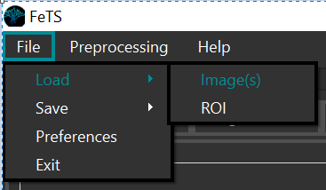
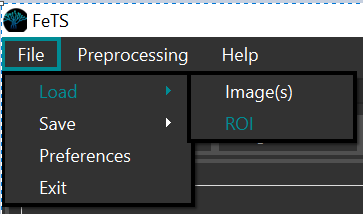
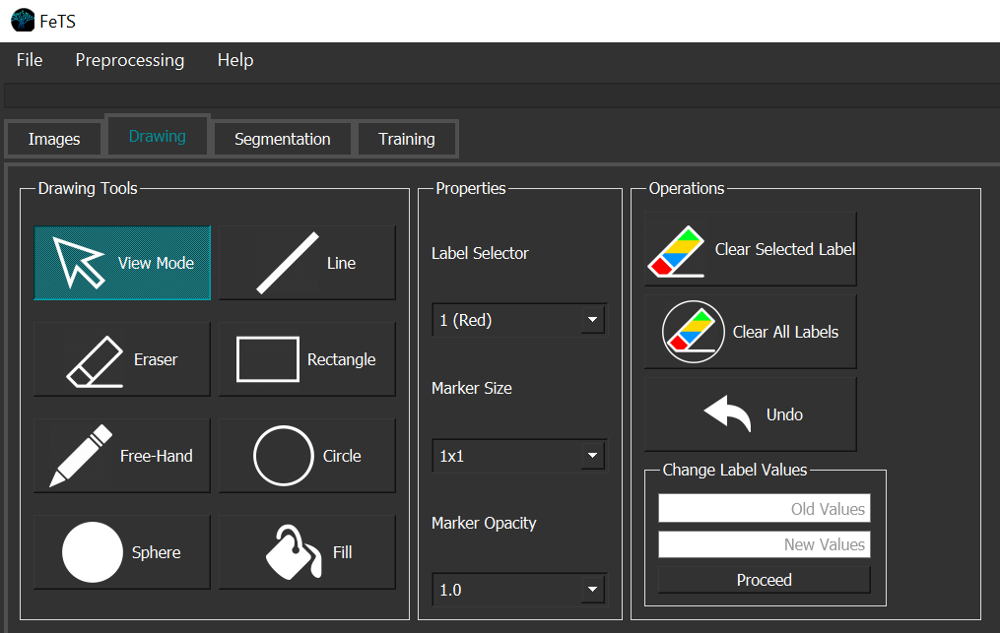

# Running the Application

**Note** the `${fets_root_dir}` from [Setup](./setup.md#set-up-the-environment).

## Application Path

```bash
cd ${download_location}
./squashfs-root/usr/bin/FeTS # launches application
```

Please add the following path to your `LD_LIBRARY_PATH` when using FeTS: `${fets_root_dir}/lib`:
```bash
export LD_LIBRARY_PATH=${fets_root_dir}/lib:$LD_LIBRARY_PATH
```

## Inference_New

```bash
${fets_root_dir}/bin/FeTS_CLI -d /path/to/output/DataForFeTS -a deepMedic,deepscan -lF STAPLE,ITKVoting,SIMPLE -g 1 -t 0
```

The aforementioned command will perform the following steps:
- Perform inference on the prepared dataset based on selected architectures and label fusion strategies
  - **NOTE**: To run [nnUNet](https://github.com/MIC-DKFZ/nnunet), follow these steps:
    - Download weights from the following URL: ftp://www.nitrc.org/home/groups/fets/downloads/model_weights/nnunet.zip
    - Unzip it in `${fets_root_dir}/data/fets`. The directory structure should look like this:
      ```bash
      ${fets_root_dir}
      │
      └───data 
      │   │
      │   └──fets
      │   │   │
      │   │   └───nnunet
      │   │   │   │
      │   │   │   └───${training_strategy}.1_bs5 # the specific training strategy
      │   │   │   │   │
      │   │   │   │   └───fold_${k} # different folds
      │   │   │   │   │   │ ...
      ```
    - This will now be available as a model for inference using the `FeTS_CLI` application under the `-a` parameter.
- Leverage the GPU
- Place inference results on a per-subject basis for quality-control:
  ```bash
  DataForFeTS
  │
  └───Patient_001 # this is constructed from the ${PatientID} header of CSV
  │   │ Patient_001_brain_t1.nii.gz
  │   │ Patient_001_brain_t1ce.nii.gz
  │   │ Patient_001_brain_t2.nii.gz
  │   │ Patient_001_brain_t2flair.nii.gz
  │   │
  │   └──SegmentationsForQC
  │   │   │ Patient_001_3dresunet_seg.nii.gz     # individual architecture results
  │   │   │ Patient_001_deepmedic_seg.nii.gz
  │   │   │ Patient_001_nnunet_seg.nii.gz
  │   │   │ Patient_001_deepscan_seg.nii.gz
  │   │   │ Patient_001_fused_staple_seg.nii.gz  # label fusions using different methods
  │   │   │ Patient_001_fused_simple_seg.nii.gz
  │   │   │ Patient_001_fused_itkvoting_seg.nii.gz
  │
  └───Patient_002
  │   │ ...
  ```

## Manual corrections
- Use the FeTS graphical interface (or your preferred GUI annotation tool) to load each subject's images:

  
- And each segmentation (either individual architectures or the fusions) separately:

  
- Perform quality control and appropriate manual corrections for each tumor region using the annotation tools:

  
  - Ensure BraTS annotation protocol is followed for labels:

  | Label |  Region  | Acronym |
  |:-----:|:--------:|:-------:|
  |   1   |    Necrotic + Non-Enhancing-Tumor core   |   NET   |
  |   2   |   Edema   |    ED   |
  |   4   | Enhancing |    ET   |
  
- Save the final tumor segmentation as `${SubjectID}_final_seg.nii.gz` under the subject's directory:
  ```bash
  DataForFeTS
  │
  └───Patient_001 # this is constructed from the ${PatientID} header of CSV
  │   │ Patient_001_brain_t1.nii.gz
  │   │ Patient_001_brain_t1ce.nii.gz
  │   │ Patient_001_brain_t2.nii.gz
  │   │ Patient_001_brain_t2flair.nii.gz
  │   │ Patient_001_final_seg.nii.gz # NOTE: training will not work without any of these files!!!
  │
  └───Patient_002
  │   │ ...
  ```
  - **NOTE**: this file is is used during training and the subject will be skipped if this is absent

## Training_New

```bash
${fets_root_dir}/bin/FeTS_CLI -d /path/to/output/DataForFeTS -g 1 -t 1
```
The aforementioned command will perform the following steps:
- Train a model with a 3DResUNet architecture (more architectures will be made available in future releases) for all the *complete* subjects (i.e., with `${SubjectID}_final_seg.nii.gz` and all 4 structural modalities present) in a collaborative manner
- Leverage the GPU

---
# Older documentation
## Inference

<p align="center">
    
</p>

- Ensure the data has been pre-processed and is organized in the format described above.
- Click to the **Segmentation** tab in the UI
- Set up the inputs:
  - Select the input directory, which would be `/data_folder` in the above illustration
- From the "Algorithms" group, select the appropritate model (for Phase-1, we are providing pre-trained models using the 3DResUNet architecture):
  - Skull Stripping 
  - Brain Tumor Segmentation
- Select if you want to run the inference on GPU or CPU
- Click "Fusion + Save" to start
- Use the drawing tools provided in the "Drawing" tab for corrections and save the final segmentation.
- **Command-line usage**:
  - Skull-stripping:
  ```bash
  cd ${fets_root_dir}/OpenFederatedLearning
  ./venv/bin/python ./bin/run_inference_from_flplan.py \
  -nmwf pt_3dresunet_ss_brainmagebrats_best.pt \
  -p pt_3dresunet_ss_brainmagebrats.yaml \
  -md cuda \ # if not provided, defaults to "cpu"
  -d ${path_to_input_directory} -ld ${directory_to_save_logs}
  ```
  - Brain Tumor Segmentation:
  ```bash
  cd ${fets_root_dir}/OpenFederatedLearning
  ./venv/bin/python ./bin/run_inference_from_flplan.py \
  -mwf pt_3dresunet_brainmagebrats_best.pbuf \ # for initial inference, use pt_3dresunet_brainmagebrats_init.pbuf 
  -p pt_3dresunet_brainmagebrats.yaml \
  -md cuda \ # if not provided, defaults to "cpu"
  -d ${path_to_input_directory} -ld ${directory_to_save_logs}
  ```
- **Note**: 
  - For CPU, a run-time requirement of at least 48GB of RAM would be needed
  - For GPU, at least 11GB of dedicated VRAM would be needed

## Training

<p align="center">
    
</p>

- Ensure the data has been pre-processed and is organized in the format described above.
  - Note that there should be **only 1** file that ends in `_seg.nii.gz`, as this will be used for training the Brain Tumor Segmentation model
- Click to the **Segmentation** tab in the UI
- Set up the inputs:
  - Select the input directory, which would be `/data_folder` in the above illustration
  - Type the correct common collaboration name, which would be `${collaborator_common_name}`
- For Phase-1, we currently support training on the 3DResUNet architecture for Brain Tumor Segmentation.
- Select if you want to run the inference on GPU or CPU
- Click "Train + Save" to start
- **Command-line usage**:
```bash
cd ${fets_root_dir}/OpenFederatedLearning
./venv/bin/python ./bin/run_collaborator_from_flplan.py \
-p pt_3dresunet_brainmagebrats.yaml \
-d ${path_to_input_directory} \
-md cuda \ # if not provided, defaults to "cpu"
-ld ${directory_to_save_logs} -col ${collaborator_common_name}
```
