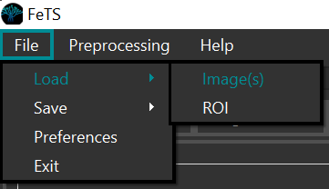
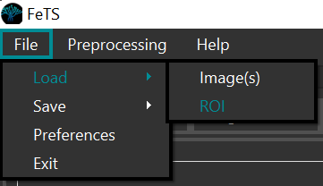

# Running the Application

**Note** the `${fets_root_dir}` from [Setup](./setup.md#set-up-the-environment).

## Table of Contents
- [Application Path](#application-path)
- [Inference](#inference)
- [Manual corrections](#manual-corrections)
- [Sanity check](#sanity-check)
- [Training](#training)

## Application Path

```bash
cd ${download_location}
${fets_root_dir}/bin/FeTS # launches application
```

Please add the following path to your `LD_LIBRARY_PATH` when using FeTS: `${fets_root_dir}/lib`:
```bash
export LD_LIBRARY_PATH=${fets_root_dir}/lib:$LD_LIBRARY_PATH
```

[Back To Top &uarr;](#table-of-contents)

## Inference

```bash
${fets_root_dir}/bin/FeTS_CLI -d /path/to/output/DataForFeTS \ # data directory after invoking ${fets_root_dir}/bin/PrepareDataset
  -a deepMedic,nnunet,deepscan \ # all pre-trained models currently available in FeTS see notes below for more details
  -lF STAPLE,ITKVoting,SIMPLE,MajorityVoting \ # todo: select the most appropriate after Ujjwal's analysis
  -g 1 \ # '0': cpu, '1': request gpu
  -t 0 # '0': inference mode, '1': training mode
```

The aforementioned command will perform the following steps:
- Perform inference on the prepared dataset based on selected architectures and label fusion strategies
  - **NOTES**: 
    - [nnUNet](https://doi.org/10.1038/s41592-020-01008-z) should have been downloaded during the installation process. In case there was a failure, follow these steps:
      - Download weights from [this URL](https://upenn.box.com/v/fets-weights-nnunet) or from the command line:
        ```bash
        cd ${fets_root_dir}/data/fets
        wget https://upenn.box.com/shared/static/f7zt19d08c545qt3tcaeg7b37z6qafum.zip -O nnunet.zip
        unzip nnunet.zip
        ```
      - Unzip it in `${fets_root_dir}/data/fets`. The directory structure should look like this:
        ```bash
        ${fets_root_dir}
        │
        └───data 
        │   │
        │   └──fets
        │   │   │
        │   │   └───nnunet
        │   │   │   │
        │   │   │   └───${training_strategy}.1_bs5 # the specific training strategy
        │   │   │   │   │
        │   │   │   │   └───fold_${k} # different folds
        │   │   │   │   │   │ ...
        ```
      - This will now be available as a model for inference using the `FeTS_CLI` application under the `-a` parameter.
    - To run [DeepScan](https://doi.org/10.1007/978-3-030-11726-9_40), at least 120G of RAM is needed. 
    - [DeepMedic](https://doi.org/10.1016/j.media.2016.10.004) runs as a CPU-only task.
- Leverage the GPU
- Place inference results on a per-subject basis for quality-control:
  ```bash
  DataForFeTS
  │
  └───Patient_001 # this is constructed from the ${PatientID} header of CSV
  │   │ Patient_001_brain_t1.nii.gz
  │   │ Patient_001_brain_t1ce.nii.gz
  │   │ Patient_001_brain_t2.nii.gz
  │   │ Patient_001_brain_t2flair.nii.gz
  │   │
  │   └──SegmentationsForQC
  │   │   │ Patient_001_deepmedic_seg.nii.gz # individual architecture results
  │   │   │ Patient_001_nnunet_seg.nii.gz
  │   │   │ Patient_001_deepscan_seg.nii.gz
  │   │   │ Patient_001_fused_staple_seg.nii.gz # label fusions using different methods
  │   │   │ Patient_001_fused_simple_seg.nii.gz
  │   │   │ Patient_001_fused_itkvoting_seg.nii.gz
  │
  └───Pat_JohnDoe
  │   │ ...
  ```

[Back To Top &uarr;](#table-of-contents)

## Manual Corrections
- Use the FeTS graphical interface (or your preferred GUI annotation tool such as [ITK-SNAP](http://www.itksnap.org/pmwiki/pmwiki.php) or [3D-Slicer](https://www.slicer.org/)) to load each subject's images:

  
- And each segmentation (either individual architectures or the fusions) separately:

  
- Perform quality control and appropriate manual corrections for each tumor region using the annotation tools:

  
  - Ensure BraTS annotation protocol is followed for labels:

  | Label |  Region  | Acronym |
  |:-----:|:--------:|:-------:|
  |   1   |    Necrotic + Non-Enhancing-Tumor core   |   NET   |
  |   2   |   Edema   |    ED   |
  |   4   | Enhancing |    ET   |
  
- Save the final tumor segmentation as `${SubjectID}_final_seg.nii.gz` under the subject's directory:
  ```bash
  DataForFeTS
  │
  └───Patient_001 # this is constructed from the ${PatientID} header of CSV
  │   │ Patient_001_brain_t1.nii.gz
  │   │ Patient_001_brain_t1ce.nii.gz
  │   │ Patient_001_brain_t2.nii.gz
  │   │ Patient_001_brain_t2flair.nii.gz
  │   │ Patient_001_final_seg.nii.gz # NOTE: training will not work if this is absent!!!
  │
  └───Pat_JohnDoe
  │   │ ...
  ```
  - **NOTE**: this file is is used during training and the subject will be skipped if this is absent

[Back To Top &uarr;](#table-of-contents)

## Sanity Check

Before starting final training, please run the following command to ensure the input dataset is as expected:

```bash
cd ${fets_root_dir}/bin
./OpenFederatedLearning/venv/bin/python ./SanityCheck.py \
  -inputDir /path/to/output/DataForFeTS \
  -outputFile /path/to/output/sanity_output.csv
```

**Note**: If you are running FeTS version 0.0.2 (you can check version using ```FeTS_CLI --version```), please do the following to get the SanityChecker for your installation:

```bash
cd ${fets_root_dir}/bin
wget https://raw.githubusercontent.com/FETS-AI/Front-End/master/src/applications/SanityCheck.py
```
[Back To Top &uarr;](#table-of-contents)

## Training

### Transfer certificates

If you have a signed certificate from a previous installation, ensure they are copied before trying to train:
```bash
cd ${fets_root_dir}/bin/
cp -r ${fets_root_dir_old}/bin/OpenFederatedLearning/bin/federations/pki/client ./OpenFederatedLearning/bin/federations/pki
```

### Start Training

```bash
${fets_root_dir}/bin/FeTS_CLI -d /path/to/output/DataForFeTS \ # input data, ensure "final_seg" is present for each subject
  -c ${collaborator_common_name} \ # common collaborator name created during setup
  -g 1 -t 1 # request gpu and enable training mode
```
The aforementioned command will perform the following steps:
- Train a model with a 3DResUNet architecture (more architectures will be made available in future releases) for all the *complete* subjects (i.e., with `${SubjectID}_final_seg.nii.gz` and all 4 structural modalities present) in a collaborative manner
- Leverage the GPU

[Back To Top &uarr;](#table-of-contents)

---
<a href="mailto:admin@fets.ai">Next: Contact FeTS Admin</a>

---

---
